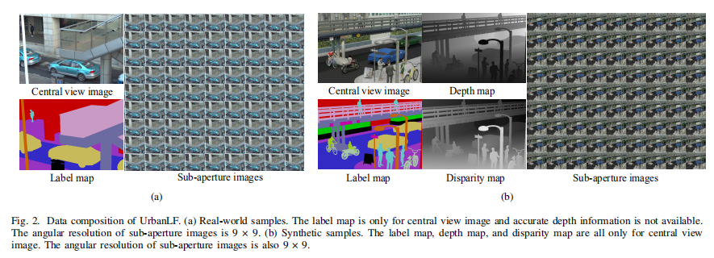

# UrbanLF

This is the official repository of the UrbanLF dataset. For technical details, please refer to: UrbanLF: A New Light Field Dataset For Semantic Segmentation of Urban Scene.

## Dataset

UrbanLF is a high-quality and challenging urban scene light field dataset, containing real samples as well as synthetic samples.  The details are shown in table.

| Type         | Device      | Angle Resolution | Spatial Resolution | Element                                                      |
| ------------ | ----------- | ---------------- | ------------------ | ------------------------------------------------------------ |
| UrbanLF-Real | Lytro Illum | 9×9              | 623×432            | sub-aperture images, label annotations of central view.      |
| UrbanLF-Syn  | Blender     | 9×9              | 640×480            | sub-aperture images, label annotations of central view, depth and disparity information of central view. |

The effective depth does not exceed 100 meters and the value of sky that can not be measured is set to 200.

 

## Benchmark

Our benchmark will be available online soon.

### Semantic Segmentation

#### Class Selection

There are 14 classes for evaluation and their definitions are shown in the table. 

| Name         | Label | RGB           | Definition                                                   |
| ------------ | ----- | ------------- | ------------------------------------------------------------ |
| bike         | 1     | [168,198,168] | Bicycle, motorcycle, tricycle, and other transport without windows. |
| building     | 2     | [198,0,0]     | Skyscraper, house, bus stop, tent and other buildings, including billboard, glass, scaffolding, pole, and other objects attached to them with no more than 20% in pixels. |
| fence        | 3     | [202,154,198] | Fence with holes and plate or board used for isolation, including objects can be seen through the holes of fence in real-world scene.    |
| others       | 4     | [0,0,0]       | All objects that do not belong to the other 13 classes, such as soil, sand, grass, stone, trash can, chair, thing with large diameters attached to pole. |
| person       | 5     | [100,198,198] | People who walk upright or stand still, including objects carried by people but not in contact with the ground. This class also includes someone pushing a bike or standing next to it with both legs on the same side. |
| pole         | 6     | [198,100,0]   | Vertically oriented pole with horizontal part and brackets on it, such as sign pole and traffic light pole, including objects attached to the pole that do not belong to the traffic sign and the diameter at most twice of the pole in pixels. |
| road         | 7     | [52,42,198]   | The ground on which vehicles drive on, including small objects and markings on it. |
| sidewalk     | 8     | [154,52,192]  | The ground which is designed for pedestrians, including the part with a height difference from the boundary of the road. Vehicles are not allowed to drive on it. |
| traffic sign | 9     | [198,0,168]   | Signs that provide traffic information for pedestrians and drivers, such as traffic sign, parking sign, direction sign, and traffic light without pole. |
| vegetation   | 10    | [0,198,0]     | Tree and shrub with a certain height from the ground, including objects can be seen through the thin gaps between leaves and trunk in real-world scene. |
| vehicle      | 11    | [198,186,90]  | Car, bus, truck and other common large vehicles consist of 4 or more wheels and include all objects visible through the window. |
| bridge       | 12    | [108,107,161] | Bridge with a certain height from the ground. |
| rider        | 13    | [156,200,26]  | People who ride a bike, including objects carried by people but not in contact with the ground. |
| sky          | 14    | [158,179,202] | Open sky includes fog or thin electrical wires in front of it. |

#### Dataset Splitting

| Dataset      | Application                                          | Train | Val  | Test |
| ------------ | ---------------------------------------------------- | ----- | ---- | ---- |
| UrbanLF-Real | RGB, video, light field semantic segmentation        | 580   | 80   | 164  |
| UrbanLF-Syn  | RGB, video, RGB-D, light field semantic segmentation | 172   | 28   | 50   |

#### Data Link

Data is publicly available in [Baiduyun](https://pan.baidu.com/s/1r0ZVhQoYb3coL7IHu98PfQ) (key: 6ew2) and [Google](https://drive.google.com/drive/folders/1ke8kLYmEE1Lt7vVjw-y7_vWoCh0wkpEM?usp=sharing).

#### Note

**The metrics (mIoU, mAcc, Acc) are calculated only in full resolution of central view image.**

 

 

### Super Resolution

#### Data generation

Our benchmark provides ×2 and ×4 light field spatial super resolution (LFSSR). The bicubic interpolation with a factor of 2 and 4 is applied to generate low resolution images of different scales. Due to the limitation of resolution, the real images are preprocessed before generating the test data. For ×2 task, we crop 1 pixel width on the right.  For ×4 task, we crop 2 pixel width on the right and 1 pixel width on the left. 

#### Dataset Splitting

Considering that sharing the same test data with other benchmarks will expose the ground truth, we extra collect 80 real and 30 synthetic samples as two new test sets. 

| Dataset      | Train | Val  | Test |
| ------------ | ----- | ---- | ---- |
| UrbanLF-Real | 744   | 80   | 80   |
| UrbanLF-Syn  | 222   | 28   | 30   |

#### Data Link

Data is publicly available in [Baiduyun](https://pan.baidu.com/s/1Inl81BwQNy2gXnE1Gi_lcw) (key: 7cwp) and [Google](https://drive.google.com/drive/folders/17NJ14raPXrECAkGHUmmv44wVo_aIEQ2x?usp=sharing).

#### Note

**The metrics (PSNR, SSIM) are calculated by averaging over all sub-aperture images.**

**The spatial resolution of the prediction for real images should be 622×432 for ×2 task and 620×432 for ×4 task.**

 

 

### Depth Estimation

Only UrbanLF-Syn has ground truth disparity with range [−0.47,1.55] pixels between adjacent views.

#### Dataset Splitting

We create a new test set to avoid the disparity data leakage owing to data sharing among benchmarks and provide maximum and minimum disparity value.

| Dataset     | Train | Val  | Test |
| ----------- | ----- | ---- | ---- |
| UrbanLF-Syn | 170   | 30   | 30   |

#### Data Link

Data is publicly available in [Baiduyun](https://pan.baidu.com/s/1PpYolOSlxQt-J6y8o6F0Ow) (key: f54t) and [Google](https://drive.google.com/drive/folders/1Sh6-4JCI0PDAZNqpK1T9NB9B6OeITCc0?usp=sharing).

#### Note

**The metrics (MSE, BP) are calculated only on central view image with cropping 15 pixels at each border.**

 

 

## Citation

This work is submitted to IEEE Transactions on Computational Imaging(TCI) 2021.

 

## Statement

Most people and owners of the vehicles captured in the dataset have signed a license to allow the images to be used for scientific research. If the work violates your right to privacy, please send an email to congrx@buaa.edu.cn .