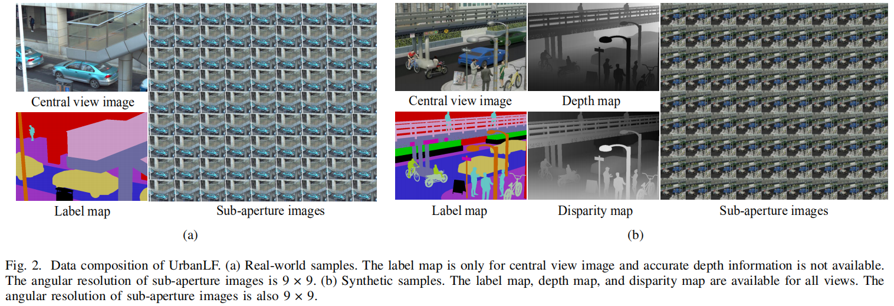
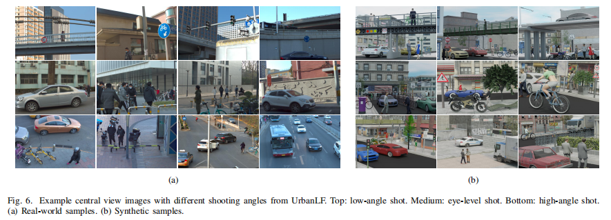
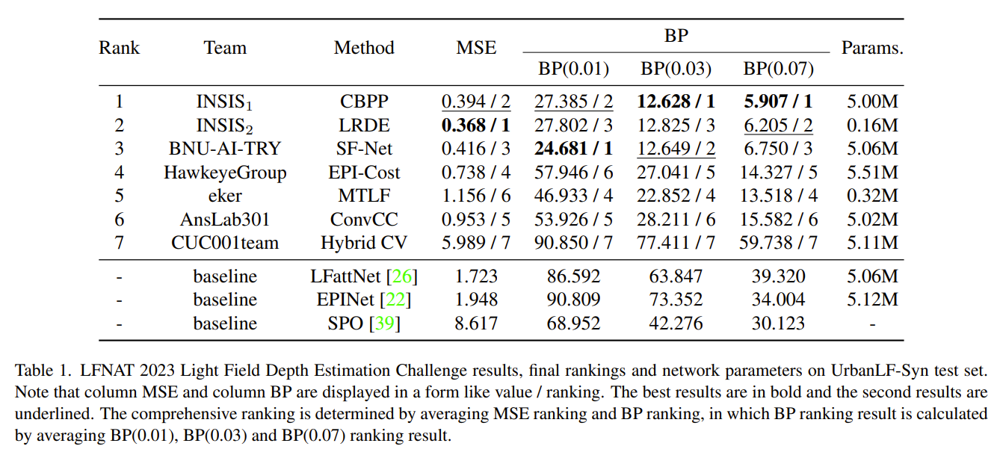

# Dataset

## UrbanLF

**UrbanLF** is a high-quality and challenging urban scene light field dataset, containing real samples as well as synthetic samples. For technical details, please refer to: [UrbanLF: A New Light Field Dataset For Semantic Segmentation of Urban Scene. (IEEE TCSVT 2022)](<https://doi.org/10.1109/TCSVT.2022.3187664>)

| Type         | Device      | Angle Resolution | Spatial Resolution | Element                                                      |
| ------------ | ----------- | ---------------- | ------------------ | ------------------------------------------------------------ |
| UrbanLF-Real | Lytro Illum | 9×9              | 623×432            | sub-aperture images, label annotations of central view.      |
| UrbanLF-Syn  | Blender     | 9×9              | 640×480            | sub-aperture images, label annotations of all 81 views, depth and disparity information of all 81 views. |





The effective depth does not exceed 100 meters and the value of sky that can not be measured is set to 200. 

<br/>

## UrbanLF-Multiscale-Baseline-Dataset
**UrbanLF-Multiscale-Baseline-Dataset** is a high-quality and challenging urban scene light field dataset, **containing sparsely sampled as well as densely sampled synthetic light field samples that share the same scenarios**. It is created by Blender on the basis of UrbanLF-Syn. For technical details, please refer to: [End-to-End Semantic Segmentation Utilizing Multi-scale Baseline Light Field. (IEEE TCSVT 2024)](<https://ieeexplore.ieee.org/document/10440124>)

| Type             | Device | Disparity Range| Angle Resolution | Spatial Resolution | Element                                                      |
| ---------------- | -------|-----------| ---------------- | ------------------ | ------------------------------------------------------------ |
| UrbanLF-Syn-Big  |Blender |[-7.39,7.07]| 9×9              | 640×480            | sub-aperture images, label annotations of all 81 views, depth and disparity information of all 81 views. |
| UrbanLF-Syn-Small|Blender |[-0.47,1.58]| 9×9              | 640×480            | sub-aperture images, label annotations of all 81 views, depth and disparity information of all 81 views. |

Among the 400 scenarios corresponding to 400 samples, 250 of them are from UrbanLF-Syn, and the remaining 150 scenarios are newly built.

<br/>

## Non-Lambertian-LF

**Non-Lambertian-LF** is a synthetic light field depth estimation dataset focused on non-Lambertian objects. It is available at [here](<https://github.com/ZhenglongCui/Non-Lambertian-Light-Field/tree/main>).
| Type              | Device  | Angle Resolution | Spatial Resolution | Element                                                      |
| ------------------| --------| ---------------- | ------------------ | ------------------------------------------------------------ |
| Non-Lambertian-LF | Blender | 9×9              | 926×926            | sub-aperture images, disparity information of central view.  |

<br/>

# Benchmark

Our benchmark has been held with **[the 3rd Workshop on Light Fields for Computer Vision LFNAT: New Applications and Trends in Light Fields in conjunction with CVPR 2023](http://www.lfchallenge.com/LFNAT@CVPR2023/home/)**.


## Semantic Segmentation

### Class Selection

There are 14 classes for evaluation and their definitions are shown in the table. 

| Name         | Label | RGB           | Definition                                                   |
| ------------ | ----- | ------------- | ------------------------------------------------------------ |
| bike         | 1     | [168,198,168] | <font size = 2>Bicycle, motorcycle, tricycle, and other transport without windows.</font> |
| building     | 2     | [198,0,0]     | <font size = 2>Skyscraper, house, bus stop, tent and other buildings, including billboard, glass, scaffolding, pole, and other objects attached to them with no more than 20% in pixels.</font> |
| fence        | 3     | [202,154,198] | <font size = 2>Fence with holes and plate or board used for isolation, including objects can be seen through the holes of fence in real-world scene.   </font> |
| others       | 4     | [0,0,0]       | <font size = 2>All objects that do not belong to the other 13 classes, such as soil, sand, grass, stone, trash can, chair, thing with large diameters attached to pole.</font> |
| person       | 5     | [100,198,198] | <font size = 2>People who walk upright or stand still, including objects carried by people but not in contact with the ground. This class also includes someone pushing a bike or standing next to it with both legs on the same side.</font> |
| pole         | 6     | [198,100,0]   | <font size = 2>Vertically oriented pole with horizontal part and brackets on it, such as sign pole and traffic light pole, including objects attached to the pole that do not belong to the traffic sign and the diameter at most twice of the pole in pixels.</font> |
| road         | 7     | [52,42,198]   | <font size = 2>The ground on which vehicles drive on, including small objects and markings on it.</font> |
| sidewalk     | 8     | [154,52,192]  | <font size = 2>The ground which is designed for pedestrians, including the part with a height difference from the boundary of the road. Vehicles are not allowed to drive on it.</font> |
| traffic sign | 9     | [198,0,168]   | <font size = 2>Signs that provide traffic information for pedestrians and drivers, such as traffic sign, parking sign, direction sign, and traffic light without pole.</font> |
| vegetation   | 10    | [0,198,0]     | <font size = 2>Tree and shrub with a certain height from the ground, including objects can be seen through the thin gaps between leaves and trunk in real-world scene.</font> |
| vehicle      | 11    | [198,186,90]  | <font size = 2>Car, bus, truck and other common large vehicles consist of 4 or more wheels and include all objects visible through the window.</font> |
| bridge       | 12    | [108,107,161] | <font size = 2>Bridge with a certain height from the ground.</font> |
| rider        | 13    | [156,200,26]  | <font size = 2>People who ride a bike, including objects carried by people but not in contact with the ground.</font> |
| sky          | 14    | [158,179,202] | <font size = 2>Open sky includes fog or thin electrical wires in front of it.</font> |

### Dataset Splitting

| Dataset            | Application                                          | Train | Val  | Test |
| ------------       | ---------------------------------------------------- | ----- | ---- | ---- |
| UrbanLF-Real       | RGB, video, light field semantic segmentation        | 580   | 80   | 164  |
| UrbanLF-Syn        | RGB, video, RGB-D, light field semantic segmentation | 172   | 28   | 50   |
| UrbanLF-Syn-Big    | RGB, video, RGB-D, light field semantic segmentation | 280   | 40   | 80   |
| UrbanLF-Syn-Small  | RGB, video, RGB-D, light field semantic segmentation | 280   | 40   | 80   |

### Data Link

UrbanLF-Real and UrbanLF-Syn are publicly available in [Baiduyun](https://pan.baidu.com/s/1r0ZVhQoYb3coL7IHu98PfQ) (key: 6ew2) and [Google](https://drive.google.com/drive/folders/1ke8kLYmEE1Lt7vVjw-y7_vWoCh0wkpEM?usp=sharing). <br/>
UrbanLF-Syn-Big is publicly available in [Baiduyun](https://pan.baidu.com/s/1rqcS02kaO4i5gXCle-UAjw?pwd=ekw1) (key: ekw1) and [Google](https://drive.google.com/drive/folders/1qJTat8pyO5bHwhnqvq-zlmPw9-M0npWK?usp=sharing). <br/>
UrbanLF-Syn-Small is publicly available in [Baiduyun](https://pan.baidu.com/s/1JH0gTwbfXM0Etv0DR5H91A?pwd=0cp1) (key: 0cp1) and [Google](https://drive.google.com/drive/folders/136uwBgbM5HeKnRKYvYpozaslumPa0jtz?usp=drive_link). <br/>

### Note

**The metrics (mIoU, mAcc, Acc) are calculated only in full resolution of central view image.**

<br/>

<br/>

## Super Resolution

### Data generation

Our benchmark provides ×2 and ×4 light field spatial super resolution (LFSSR). The bicubic interpolation with a factor of 2 and 4 is applied to generate low resolution images of different scales. Due to the limitation of resolution, the real images are preprocessed before generating the test data. For ×2 task, we crop 1 pixel width on the right.  For ×4 task, we crop 2 pixel width on the right and 1 pixel width on the left. 

### Dataset Splitting

Considering that sharing the same test data with other benchmarks will expose the ground truth, we extra collect 80 real and 30 synthetic samples as two new test sets. 

| Dataset            | Train | Val  | Test |
| -----------------  | ----- | ---- | ---- |
| UrbanLF-Real       | 744   | 80   | 80   |
| UrbanLF-Syn        | 222   | 28   | 30   |


### Data Link

Data is publicly available in [Baiduyun](https://pan.baidu.com/s/1Inl81BwQNy2gXnE1Gi_lcw) (key: 7cwp) and [Google](https://drive.google.com/drive/folders/17NJ14raPXrECAkGHUmmv44wVo_aIEQ2x?usp=sharing).


### Note

**The metrics (PSNR, SSIM) are calculated by averaging over all sub-aperture images.**

**The spatial resolution of the prediction for real images should be 622×432 for ×2 task and 620×432 for ×4 task.**

<br/>

<br/>

## Depth Estimation

Only UrbanLF-Syn has ground truth disparity with range [−0.47,1.55] pixels between adjacent views.

For UrbanLF-Syn-big-dis, it has ground truth disparity with range [−7.09,7.05] pixels between adjacent views.

### Dataset Splitting

We create a new test set to avoid the disparity data leakage owing to data sharing among benchmarks and provide maximum and minimum disparity value.

| Dataset     | Train | Val  | Test |
| ----------- | ----- | ---- | ---- |
| UrbanLF-Syn | 170   | 30   | 30   |

### Data Link

Data is publicly available in [Baiduyun](https://pan.baidu.com/s/1PpYolOSlxQt-J6y8o6F0Ow) (key: f54t) and [Google](https://drive.google.com/drive/folders/1Sh6-4JCI0PDAZNqpK1T9NB9B6OeITCc0?usp=sharing).

### Note

**The metrics (MSE, BP) are calculated only on central view image with cropping 15 pixels at each border.**

### Benchmark Result of LFNAT 2023 CVPR Workshop
In conjunction with the workshop on Light Fields for Computer Vision LFNAT, we host a light field depth estimation challenge based upon UrbanLF-Syn. For result analysis details, please refer to: [LFNAT 2023 Challenge on Light Field Depth Estimation: Methods and Results. (CVPRW 2023)](<https://openaccess.thecvf.com/content/CVPR2023W/LFNAT/html/Sheng_LFNAT_2023_Challenge_on_Light_Field_Depth_Estimation_Methods_and_CVPRW_2023_paper.html>)



### Citation
```
@InProceedings{Sheng2023lfnat,
    author    = {Sheng, Hao and Liu, Yebin and Yu, Jingyi and Wu, Gaochang and Xiong, Wei and Cong, Ruixuan and Chen, Rongshan and others},
    title     = {LFNAT 2023 Challenge on Light Field Depth Estimation: Methods and Results},
    booktitle = {Proceedings of the IEEE/CVF Conference on Computer Vision and Pattern Recognition (CVPR) Workshops},
    month     = {June},
    year      = {2023},
    pages     = {3472-3484}
}
```

<br/>

<br/>


# News & Updates
- Feb 27, 2024: Upload UrbanLF-Multiscale-Baseline-Dataset on the basis of UrbanLF-Syn that contains large disparity as well as small disparity samples.
- Jun 20, 2023: Update Light Field Depth Estimation Challenge Result of 2023 LFNAT CVPR Workshop Based on UrbanLF-Syn dataset.
- Jan 20, 2023: Non-Lambertian-LF dataset for non-Lambertian light field depth estimation is available.
- Jan 17, 2023: Benchmark online available.


<br/>

<br/>

# Citation

If you find this work is helpful to you, please cite the following paper:

```
@ARTICLE{sheng2022urbanlf,
  author={Sheng, Hao and Cong, Ruixuan and Yang, Da and Chen, Rongshan and Wang, Sizhe and Cui, Zhenglong},
  journal={IEEE Transactions on Circuits and Systems for Video Technology}, 
  title={UrbanLF: A Comprehensive Light Field Dataset for Semantic Segmentation of Urban Scenes}, 
  year={2022},
  volume={32},
  number={11},
  pages={7880-7893},
  doi={10.1109/TCSVT.2022.3187664}}

@ARTICLE{cong2024lfienetplus,
  author={Cong, Ruixuan and Sheng, Hao and Yang, Dazhi and Yang, Da and Chen, Rongshan and Wang, Sizhe and Cui, Zhenglong},
  journal={IEEE Transactions on Circuits and Systems for Video Technology}, 
  title={End-to-End Semantic Segmentation Utilizing Multi-scale Baseline Light Field}, 
  year={2024},
  doi={10.1109/TCSVT.2024.3367370}}
```

<br/>

# Statement

Most people and owners of the vehicles captured in the dataset have signed a license to allow the images to be used for scientific research. If the work violates your right to privacy, please send an email to congrx@buaa.edu.cn .
